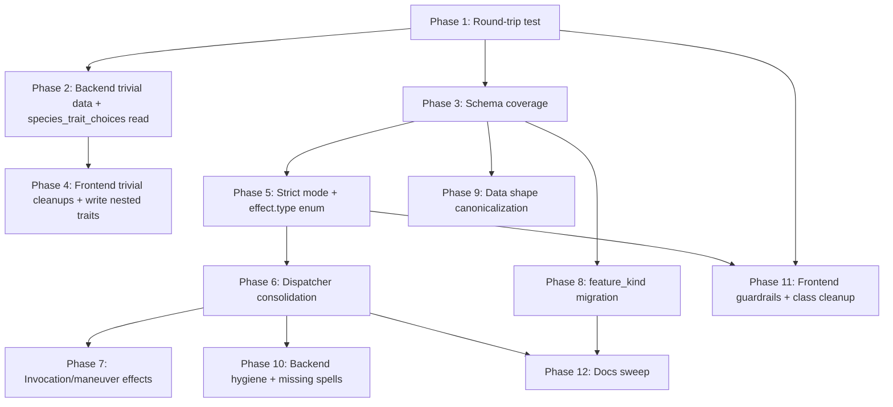

# Audit Fix Plan — 2026-05

**Audit source:** [docs/CODE_QUALITY_AUDIT_2026-05.md](CODE_QUALITY_AUDIT_2026-05.md)
**Date:** 2026-05-21
**Status:** Planning artifact only. No implementation begins until the user approves and the architect delegates.

## 1. Header

### Issue counts (from audit)

| Band | Count | IDs |
|------|-------|-----|
| P0   | 3     | P0-1, P0-2, P0-3 |
| P1   | 5     | P1-1, P1-2, P1-3, P1-4, P1-5 |
| P2   | 8     | P2-1, P2-2, P2-3, P2-4, P2-5, P2-6, P2-7, P2-8 |
| P3   | 3     | P3-1, P3-2, P3-3 |
| D0   | 5     | D0-1, D0-2, D0-3, D0-4a, D0-4b |
| D1   | 6     | D1-1, D1-2, D1-3, D1-4, D1-7, D1-8 |
| D2   | 3     | D2-1, D2-2, D2-3 |
| D3   | 2     | D3-4, D3-5 |
| D4   | 2     | D4-1, D4-3 |
| D5   | 1     | D5 |
| D6   | 7     | D6-1, D6-2, D6-3, D6-4, D6-5, D6-6, D6-7 |
| D7   | 0     | (No drift — informational only) |
| **Total** | **45** | |

### User constraints honored

None given. Default phasing rules apply (≤12 phases, no mixed lanes per phase, HVE assets ride alongside code).

---

## 2. Executive Strategy

- **Lock the contract, then refactor under it.** Phase 1 lands the round-trip equality test so every subsequent change has a mechanical safety net. Phases 2–4 stabilize the choice contract and schema surface before any structural moves.
- **Biggest structural fix lands in Phase 6: dispatcher consolidation.** P0-3, P2-1, D1-8, and D2-1 are facets of the same problem — multiple effect-application paths. They are resolved in a single phase against the new strict mode (Phase 5) and verified by the round-trip test (Phase 1).
- **Sheet-affecting data gaps are closed immediately after the dispatcher is unified** (Phase 7), so the new uniform path is exercised by the highest-risk content (eldritch invocations, battle master maneuvers).
- **`feature_kind` migration retires every name-based branch in one cut** (Phase 8), eliminating both P2-2 and the `feature_override.json` escape hatch (P2-3, D5).
- **Frontend guardrails land last** (Phase 11), once the server-side contract is canonical, strict, and tested — otherwise client-side Zod validation calcifies the wrong shape.
- **Explicitly out of scope:** D7 (no action — no drift found). In-play-only invocation/maneuver mechanics remain prose-only per the audit's scope rule. No legacy Jinja routes touched (quarantined).

---

## 3. Dependency Graph

Key hard dependencies only:
- P0-1 frontend write (Phase 4) requires backend canonical read (Phase 2).
- P1-3 frontend cleanup (Phase 11) requires backend strict-key enforcement (Phase 5).
- P2-1 / P0-3 (Phase 6) require strict effect.type (Phase 5) to detect missed wirings.
- D0-1 / D0-2 (Phase 7) require the consolidated dispatcher (Phase 6).
- D6-2 (`feature_kind`) drives P2-2, D3-4, D3-5, D5 (all Phase 8).
- Every phase after Phase 1 leans on the round-trip equality test for verification.

---

## 4. Phase Plan

### Phase 1 — Round-trip equality safety net

- **Owner agent:** `test`
- **Issue IDs delivered:** `P0-2`
- **Scope:**
  - [tests/integration/](../tests/integration/) — new `test_rebuild_equality.py`
  - Parametrize over [test_characters/](../test_characters/) and [data/example_complete_character.json](../data/example_complete_character.json)
- **Out of scope:** Frontend round-trip warning (deferred to Phase 11 as `P3-3`).
- **Deliverables:**
  - Parametrized test that builds a character, exports `choices_made`, rebuilds, and asserts `json.dumps(c1, sort_keys=True) == json.dumps(c2, sort_keys=True)` after stripping volatile fields.
  - Helper for volatile-field stripping shared with future parity tests.
  - Update to [.github/instructions/testing.instructions.md](../.github/instructions/testing.instructions.md) requiring round-trip equality for new archetypes.
- **Verification:** `pytest tests/integration/test_rebuild_equality.py -v` passes across all fixtures. Intentionally break a value in one fixture and confirm the test fails.
- **Estimated complexity:** Small
- **Dependencies:** None

---

### Phase 2 — Backend trivial data fixes + canonical nested trait reads

- **Owner agent:** `backend`
- **Issue IDs delivered:** `P0-1` (backend half), `D0-4a`, `D1-2`, `D1-4`
- **Scope:**
  - [modules/character_builder.py](../modules/character_builder.py) — make `species_trait_choices` the canonical read path; add a legacy normalizer that lifts flat top-level trait keys into the nested object for backward compatibility with saved characters.
  - [data/subclasses/cleric/life_domain.json](../data/subclasses/cleric/life_domain.json) and any other files referencing `Power Word: Heal` / `Power Word: Kill` — strip the colon to match definitions.
  - [data/species/orc.json](../data/species/orc.json), [data/species/tiefling.json](../data/species/tiefling.json) — remove `darkvision_range`, rely on `grant_darkvision` effect.
  - All 18 files in [data/backgrounds/](../data/backgrounds/) — delete `languages: 2`.
  - [.github/instructions/choice-reference.instructions.md](../.github/instructions/choice-reference.instructions.md) — forbid flat-key storage of grouped choices.
- **Out of scope:** Frontend write change for P0-1 (Phase 4). The full `feature_override.json` retirement (Phase 8). Background shape decision D1-1 (Phase 9).
- **Deliverables:**
  - Backend accepts nested `species_trait_choices` as authoritative; lifts legacy flat keys with a one-line normalizer.
  - Spell-name colon typos fixed; `grant_spell` lookups resolve correctly.
  - `darkvision_range` removed; `languages: 2` removed from backgrounds.
  - Instructions updated.
- **Verification:**
  - Phase 1 round-trip suite still green.
  - Spot-test: build a Life Domain Cleric at level 17 and confirm `Power Word Heal` is in `always_prepared` with full metadata.
  - Spot-test: build an Orc and assert `darkvision == 60` from the effect, not the top-level key.
  - Grep `data/backgrounds/*.json` for `"languages"` returns no matches.
- **Estimated complexity:** Small
- **Dependencies:** Phase 1

---

### Phase 3 — Schema coverage for the unvalidated two-thirds of `data/`

- **Owner agent:** `data-completeness`
- **Issue IDs delivered:** `D0-3`, `D6-1`
- **Scope:**
  - [models/](../models/) — author schemas for: species, lineage (species_variant), background, feat, spell definition, spell class list, weapon, armor, weapon mastery, fighting style, eldritch invocation, languages, feature override, trait patterns.
  - [validate_data.py](../validate_data.py) — discover all unvalidated categories, apply new schemas, fail loud on shape errors.
  - [.github/instructions/data-schemas.instructions.md](../.github/instructions/data-schemas.instructions.md) — list every schema and its applyTo glob.
  - [docs/DataFiles.md](DataFiles.md) — per-category table (schema, dispatcher, external-source pattern).
- **Out of scope:** `feature_kind` enum (Phase 8 / D6-2). Closed `effect.type` enum (Phase 5 / D6-4). Stricter background schema constraints (Phase 10 / D6-5). Plural array forms (Phase 10 / D6-7).
- **Deliverables:**
  - 13+ new schemas in `models/`.
  - `validate_data.py` covers 100% of `data/`.
  - Instruction + docs updates.
- **Verification:**
  - `python validate_data.py` exits 0 against current data.
  - Intentionally introduce a shape error in one species file; confirm the script fails with a clear message; revert.
  - Phase 1 round-trip suite still green.
- **Estimated complexity:** Medium
- **Dependencies:** Phase 1

---

### Phase 4 — Frontend trivial cleanups + write nested trait choices

- **Owner agent:** `frontend`
- **Issue IDs delivered:** `P0-1` (frontend half), `P1-2`, `P1-4`, `P1-5`
- **Scope:**
  - [frontend/src/components/steps/SpeciesStep.tsx](../frontend/src/components/steps/SpeciesStep.tsx) — write trait picks under `species_trait_choices` nested object; remove flat-key writes.
  - [frontend/src/lib/api.ts](../frontend/src/lib/api.ts) — delete unused declared fields (`spells`, `cantrips`, `languages_chosen`, `species_feat_choices`, `origin_feat`) and document the dynamic-key catch-all; keep `species_trait_choices` now that it's actually used.
  - [frontend/src/components/steps/AbilitiesStep.tsx](../frontend/src/components/steps/AbilitiesStep.tsx) — always send the full 6-ability `additional_ability_modifiers` map (no zero-stripping).
  - [frontend/src/components/steps/LanguagesStep.tsx](../frontend/src/components/steps/LanguagesStep.tsx) and [frontend/src/lib/api.ts](../frontend/src/lib/api.ts) — rename `randomLanguages` → `suggestRandomLanguages` (or equivalent) and document it as a suggestion endpoint.
- **Out of scope:** Class dual-write (Phase 11 / P1-1). Dynamic key cleanup (Phase 11 / P1-3). Zod validation (Phase 11 / P3-2).
- **Deliverables:** Frontend writes the canonical nested shape; `ChoicesMade` interface matches reality.
- **Verification:**
  - `pnpm tsc --noEmit` (or workspace equivalent) passes.
  - Build a Dwarf in the wizard, export, inspect `choicesMade` — trait picks under `species_trait_choices`.
  - Phase 1 round-trip suite still green.
- **Estimated complexity:** Small
- **Dependencies:** Phase 2

---

### Phase 5 — Strict mode + closed `effect.type` enum

- **Owner agent:** `backend`
- **Issue IDs delivered:** `P2-6`, `D6-4`, `P1-3` (backend half — strict on missing `choices_made_key`)
- **Scope:**
  - [modules/character_builder.py](../modules/character_builder.py) — strict mode (default-on in tests/dev) that raises on unknown `effect['type']` and unknown top-level `choices_made` keys.
  - [modules/data_loader.py](../modules/data_loader.py) — validate `features_by_level` object shape once at load.
  - [models/](../models/) — closed enum schema for `effect.type` referenced via `$ref` from feature/trait schemas.
  - [routes/api/character.py](../routes/api/character.py) `preview-step` — make `choices_made_key` mandatory in returned sub-choices; backend resolver fails loud in strict mode when only synthesized fallback keys would match.
  - [.github/instructions/effects-system.instructions.md](../.github/instructions/effects-system.instructions.md) — document strict mode + the closed enum.
- **Out of scope:** Dispatcher consolidation (Phase 6). Frontend consumption of canonical key (Phase 11).
- **Deliverables:** Strict validators in load + apply paths; closed enum schema; instructions updated.
- **Verification:**
  - Add a fixture with an unknown effect type → load fails with a clear error.
  - Add a fixture with an unknown top-level choice key → apply raises in strict mode, warns in lenient.
  - `python validate_data.py` still 0.
  - Phase 1 round-trip suite still green.
- **Estimated complexity:** Small
- **Dependencies:** Phase 3

---

### Phase 6 — Effect dispatcher consolidation (single biggest structural fix)

- **Owner agent:** `backend`
- **Issue IDs delivered:** `P0-3`, `P2-1`, `D1-8`, `D2-1`
- **Scope:**
  - [modules/character_builder.py](../modules/character_builder.py) — collapse `_apply_effect`, `_apply_trait_effects`, and `_apply_choice_effects` to a single dispatcher `apply_effect(effect, source_label)` plus a single resolver `resolve_effects_for_choice(choice_slot, chosen_value)` covering inline JSON, external file, and feat data.
  - Remove `applied_effects` reads from `calculate_weapon_attacks()` (~L4822–4905) and `calculate_ac_options()`; store the needed deltas on weapon/AC entries at the time the effect is applied.
  - Add generic handlers (or store-on-source equivalents) for the 7 out-of-band effect types: `bonus_damage`, `bonus_attack`, `bonus_ac`, `bonus_hp`, `great_weapon_fighting`, `two_weapon_fighting_modifier`, `unarmed_fighting`.
  - [.github/instructions/effects-system.instructions.md](../.github/instructions/effects-system.instructions.md) — add the "One Dispatcher Rule" and a checklist for new effect types.
  - [.github/instructions/data-schemas.instructions.md](../.github/instructions/data-schemas.instructions.md) — document the 5 valid `effects`-array authoring locations (D1-8) with the dispatcher entry point for each.
- **Out of scope:** Adding effects to invocations/maneuvers (Phase 7). `feature_kind` migration (Phase 8). Spell metadata consolidation (Phase 10 / P2-4).
- **Deliverables:** One dispatcher, one resolver; no calculation method reads `applied_effects`; documented authoring locations.
- **Verification:**
  - Phase 1 round-trip suite green across every fixture.
  - [tests/core/test_character_builder.py](../tests/core/test_character_builder.py) + fighting-style regression tests green.
  - Add a parity test: for one Champion Fighter, assert `calculate_weapon_attacks()` produces identical output before and after by snapshotting on `main` and comparing.
  - Strict-mode load (Phase 5) reports zero new unknown effect types.
- **Estimated complexity:** Large
- **Dependencies:** Phase 5

---

### Phase 7 — Eldritch invocations + battle master maneuvers gain effects

- **Owner agent:** `backend`
- **Issue IDs delivered:** `D0-1`, `D0-2`, `D4-3`
- **Scope:**
  - [data/eldritch_invocations.json](../data/eldritch_invocations.json) — add `effects` arrays to the sheet-affecting subset (Beguiling Influence, Eldritch Mind, Devil's Sight, Armor of Shadows, Fiendish Vigor, Mask of Many Faces, Misty Visions, Whispers of the Grave, Agonizing Blast, Eldritch Spear, Repelling Blast, pact-specific proficiency invocations).
  - Add new effect types where needed: `grant_spell_at_will`, `bonus_spell_damage_ability_mod`, `bonus_spell_range`. Each gets a handler in the consolidated dispatcher (Phase 6), a schema entry, a [docs/FEATURE_EFFECTS.md](FEATURE_EFFECTS.md) entry, and a test.
  - Extract battle master maneuvers to a new top-level [data/maneuvers.json](../data/maneuvers.json) (mirroring `fighting_styles.json`); update [data/subclasses/fighter/battle_master.json](../data/subclasses/fighter/battle_master.json) to reference the external file with `source.type: "external"`.
  - Add a `grant_maneuver` effect type that pushes chosen names onto `maneuvers_known` (no per-maneuver mechanics needed under the scope rule).
  - Add `effects` to [data/equipment/weapon_masteries.json](../data/equipment/weapon_masteries.json) entries whose RAW benefit changes a sheet field.
  - [.github/skills/add-game-content/SKILL.md](../.github/skills/add-game-content/SKILL.md) — verification step: external choice files must use `source.type: "external"`; sheet-affecting entries must include `effects`.
- **Out of scope:** Metamagic (does not yet exist). In-play-only invocations/maneuvers remain prose-only.
- **Deliverables:** All sheet-affecting invocations and maneuvers carry structured effects; maneuvers use the external-source pattern.
- **Verification:**
  - Build a Warlock with Beguiling Influence and assert Deception + Persuasion proficiencies appear on the rendered character.
  - Build a Warlock with Agonizing Blast and assert Eldritch Blast damage includes Cha.
  - Build a Battle Master Fighter and assert the three chosen maneuvers appear under `maneuvers_known` with correct superiority die metadata.
  - Phase 1 round-trip suite green.
- **Estimated complexity:** Medium
- **Dependencies:** Phase 6

---

### Phase 8 — `feature_kind` migration; retire `feature_override.json`

- **Owner agent:** `backend`
- **Issue IDs delivered:** `P2-2`, `P2-3`, `D3-4`, `D3-5`, `D5`, `D6-2`, `D6-3`
- **Scope:**
  - [models/class_schema.json](../models/class_schema.json), [models/subclass_schema.json](../models/subclass_schema.json) — add `feature_kind` enum (`normal | asi | subclass_pick | spellcasting_setup | subclass_feature_slot`) and promote `hidden` + `pdf_summary` to first-class feature fields.
  - All class JSONs in [data/classes/](../data/classes/) — annotate ASI features with `feature_kind: "asi"`, subclass placeholders with `feature_kind: "subclass_pick"`, etc. Backfill `hidden` and `pdf_summary` on the 6 affected entries.
  - [modules/character_builder.py](../modules/character_builder.py) — dispatch on `feature_kind`, remove name-based branches (`if normalized_trait_name == "ability score improvement"`, `if trait_name == "Spellcasting"`, the `f"{class_name} subclass"` format-coupling, the Dueling-by-name special case in weapon math).
  - Delete [data/feature_override.json](../data/feature_override.json) and its loader in `character_builder.py`.
  - [.github/instructions/data-schemas.instructions.md](../.github/instructions/data-schemas.instructions.md) — document `feature_kind` and forbid name-based branching for these categories.
  - [.github/agents/backend.md](../.github/agents/backend.md) — explicitly forbid `if feature_name == ...` / `if choice_value == ...` branching.
- **Out of scope:** Frontend-facing changes (Phase 11). Non-ASI/non-subclass-pick name branches that may need bespoke `feature_kind` values can be deferred.
- **Deliverables:** Uniform feature kinds; no name-based branching; no `feature_override.json`.
- **Verification:**
  - Phase 1 round-trip suite green across all 10 classes.
  - Grep `modules/` for `== "Ability Score Improvement"`, `== "Spellcasting"`, `" subclass"` — zero hits.
  - Build a Cleric and a Druid and confirm ASI appears (or is hidden) consistently with Fighter and Wizard.
  - `python validate_data.py` 0.
- **Estimated complexity:** Large
- **Dependencies:** Phase 3 (schemas exist), Phase 5 (strict mode catches missed conversions)

---

### Phase 9 — Data shape canonicalization

- **Owner agent:** `data-completeness`
- **Issue IDs delivered:** `D1-1`, `D1-3`, `D4-1`
- **Scope:**
  - Decide canonical shape for background mechanical benefits (`effects` array vs flat keys). Document the decision in [.github/instructions/data-schemas.instructions.md](../.github/instructions/data-schemas.instructions.md) and migrate the 18 background files in [data/backgrounds/](../data/backgrounds/) accordingly.
  - Author the species variant schema (lands as part of Phase 3 D6-1) and backfill missing `description` on [data/species_variants/rock_gnome.json](../data/species_variants/rock_gnome.json) and [data/species_variants/forest_gnome.json](../data/species_variants/forest_gnome.json). Reconcile per-lineage top-level keys (`spells_by_level`, `spellcasting_ability_choice`, `cantrip_replacement`, `darkvision`) to a defined shape.
  - Delete duplicate `spells_by_level` blocks from [data/species_variants/high_elf.json](../data/species_variants/high_elf.json), [data/species_variants/wood_elf.json](../data/species_variants/wood_elf.json), [data/species_variants/drow.json](../data/species_variants/drow.json) — the `effects` arrays inside `traits` are authoritative.
- **Out of scope:** Stricter background constraints (Phase 10 / D6-5). Plural array forms (Phase 10 / D6-7).
- **Deliverables:** One canonical shape for background mechanics; species variants pass their new schema; lineage spell lists single-sourced.
- **Verification:**
  - `python validate_data.py` 0.
  - Phase 1 round-trip suite green; specifically the High Elf / Wood Elf / Drow fixtures must produce identical spell lists pre- and post-deletion.
- **Estimated complexity:** Medium
- **Dependencies:** Phase 3

---

### Phase 10 — Backend hygiene + missing content + schema polish

- **Owner agent:** `backend`
- **Issue IDs delivered:** `P2-4`, `P2-5`, `P2-7`, `P2-8`, `D0-4b`, `D1-7`, `D2-2`, `D2-3`, `D6-5`, `D6-6`, `D6-7`
- **Scope:**
  - [modules/character_builder.py](../modules/character_builder.py) — consolidate spell metadata into a single `spell_metadata` dict with views derived in `to_character()` (`always_prepared`, `prepared`). (P2-4)
  - Decide per documented effect type without a handler: implement (`grant_weapon_mastery` as a real effect) or strike from [docs/FEATURE_EFFECTS.md](FEATURE_EFFECTS.md) (`grant_spell_slots`, `grant_damage_immunity`). (P2-5 / D2-3)
  - Delete unused modules: [modules/equipment_manager.py](../modules/equipment_manager.py), [modules/feature_manager.py](../modules/feature_manager.py), the dead path of [modules/variant_manager.py](../modules/variant_manager.py). Consolidate `_clear_species_features` / `_clear_lineage_features` and the three near-identical loops in `_clear_background_features` into a single `_remove_proficiencies_by_source(category, source)`. Remove no-op `spellcasting` and `weapon mastery` choice handlers and the `pass`-only `grant_cantrip_choice` / `alternative_ac` cases (consolidate `alternative_ac` into the dispatcher or document the deferred-handling pattern). (P2-7, D2-2)
  - Document the four-pass `apply_choices()` ordering with asserts between passes. (P2-8)
  - Author the 5 missing spell definitions in [data/spells/](../data/spells/) (`Fount of Moonlight`, `Summon Dragon`, `Yolande's Regal Presence`, `Summon Construct` variants). (D0-4b)
  - Normalize singular/plural in effect properties — allow `damage_types: [...]` array form alongside `damage_type`, etc. (D1-7 / D6-7)
  - Tighter [models/background_schema.json](../models/background_schema.json): require `feat` to reference an entry in `origin_feats.json`, `skill_proficiencies` count == 2, `ability_score_increase.total == 3`, forbid `languages: <int>`. (D6-5)
  - Add typed `$choice_ref` form to replace `"${1st_level_spell}"` placeholders. (D6-6)
  - [docs/FEATURE_EFFECTS.md](FEATURE_EFFECTS.md) — sync with reality.
- **Out of scope:** Cross-lane refactors. Anything that touches frontend.
- **Deliverables:** Cleaner backend surface, one spell metadata dict, all documented effect types either real or removed, polished schemas.
- **Verification:**
  - Phase 1 round-trip suite green.
  - `python validate_data.py` 0 under the tighter background schema.
  - `pytest tests/` full green.
  - Grep for `EquipmentManager`, `FeatureManager` — zero non-deleted hits.
- **Estimated complexity:** Medium
- **Dependencies:** Phase 6

---

### Phase 11 — Frontend canonical contract + guardrails

- **Owner agent:** `frontend`
- **Issue IDs delivered:** `P1-1`, `P1-3` (frontend half), `P3-1`, `P3-2`, `P3-3`
- **Scope:**
  - [frontend/src/components/steps/ClassStep.tsx](../frontend/src/components/steps/ClassStep.tsx), [frontend/src/store/characterStore.ts](../frontend/src/store/characterStore.ts) — write only `classes[]`; remove all writes to the flat `class` / `level` / `subclass` keys. Backend normalizer continues to accept legacy inbound payloads (read-only).
  - [frontend/src/components/wizard/FeatDropdownPicker.tsx](../frontend/src/components/wizard/FeatDropdownPicker.tsx), [frontend/src/components/wizard/FeatChoicesPicker.tsx](../frontend/src/components/wizard/FeatChoicesPicker.tsx) — use the server-provided `choices_made_key` as the only key source; remove client-side fallback synthesis.
  - [frontend/src/components/wizard/ClassAdvancedChoices.tsx](../frontend/src/components/wizard/ClassAdvancedChoices.tsx) — remove client-side filtering of always-prepared spells; rely on the server's derived endpoint output.
  - Add Zod schema mirroring the post-cleanup canonical `ChoicesMade`; validate at the api-client boundary in [frontend/src/lib/api.ts](../frontend/src/lib/api.ts).
  - Dev-mode post-build round-trip warning: log when a key in `choicesMade` does not appear in the returned `character.choices_made`.
  - [.github/instructions/frontend-architecture.instructions.md](../.github/instructions/frontend-architecture.instructions.md) — concrete anti-patterns + Zod requirement.
  - [.github/agents/frontend.md](../.github/agents/frontend.md) — forbid synthesizing choice keys, filtering server lists, dual-writing.
  - New skill [.github/skills/audit-choice-paths/SKILL.md](../.github/skills/audit-choice-paths/SKILL.md) tracing UI → store → API → resolver → dispatcher → rendered field.
- **Out of scope:** Backend strict enforcement (already in Phase 5).
- **Deliverables:** Canonical client; Zod-validated payloads; dev-mode round-trip alarm; new skill.
- **Verification:**
  - Reduce a multiclass build in the UI; confirm exported `choicesMade` has no `class` / `level` / `subclass` keys.
  - Submit a payload with an invalid shape; Zod blocks it client-side.
  - Phase 1 round-trip suite green (server-side).
  - Manual: trigger the dev-mode warning by injecting a stray key into the store; confirm it logs.
- **Estimated complexity:** Medium
- **Dependencies:** Phase 1, Phase 5

---

### Phase 12 — Final docs sweep

- **Owner agent:** `docs`
- **Issue IDs delivered:** (no audit IDs — closes out the HVE-asset items from §"What Should Change in HVE Assets" not already absorbed by earlier phases)
- **Scope:**
  - [docs/Architecture.md](Architecture.md) — add four-pass `apply_choices()` diagram and the rebuild-equality invariant.
  - [docs/APIContract.md](APIContract.md) — replace `ChoicesMade` documentation with the canonical post-Phase-4 shape; mark dynamic keys explicitly.
  - [docs/FEATURE_EFFECTS.md](FEATURE_EFFECTS.md) — final cleanup of documented vs implemented effect types (cross-check with Phase 6 + Phase 10 outcomes); document the 5 authoring locations and the closed enum.
  - [docs/DataFiles.md](DataFiles.md) — finalize the per-category table started in Phase 3.
  - [.github/skills/validate-character/SKILL.md](../.github/skills/validate-character/SKILL.md) — extend to run the round-trip equality assertion.
  - [.github/agents/data-completeness.md](../.github/agents/data-completeness.md) — promote to gating role: PRs that add prose-only sheet-affecting content are rejected.
  - [.github/agents/architect.md](../.github/agents/architect.md) — new routing rule: new choice type or new effect type triggers mandatory `data-completeness` consultation.
- **Out of scope:** Any code changes.
- **Deliverables:** Docs match the new reality; HVE assets ratchet the patterns shut.
- **Verification:** Manual review against this plan; cross-link spot-check; no broken links.
- **Estimated complexity:** Small
- **Dependencies:** Phase 6, Phase 8 (the structural changes whose state the docs must describe)

---

## 5. Agent Workload Summary

| Agent               | Phases owned                 | Issues delivered |
|---------------------|------------------------------|------------------|
| `test`              | 1                            | P0-2 (1) |
| `backend`           | 2, 5, 6, 7, 8, 10            | P0-1 (be), P0-3, P1-3 (be), P2-1, P2-2, P2-3, P2-4, P2-5, P2-6, P2-7, P2-8, D0-1, D0-2, D0-4a, D0-4b, D1-2, D1-4, D1-7, D1-8, D2-1, D2-2, D2-3, D3-4, D3-5, D4-3, D5, D6-3, D6-4, D6-6, D6-7 (≈30) |
| `data-completeness` | 3, 9                         | D0-3, D1-1, D1-3, D4-1, D6-1 (5; +D6-5 schema authored in Phase 3, applied in Phase 10) |
| `frontend`          | 4, 11                        | P0-1 (fe), P1-1, P1-2, P1-3 (fe), P1-4, P1-5, P3-1, P3-2, P3-3 (9) |
| `docs`              | 12                           | (HVE/docs only) |
| `architect`         | (planning only — this doc)   | — |

`backend` is the heaviest lane (expected — most defects live in `modules/`). `frontend` carries the choice-contract guardrails. `data-completeness` owns the schema surface. No agent is under-loaded.

---

## 6. Risk Register

- **Phase 6 — Dispatcher consolidation**
  - **Risk:** Removing `applied_effects` reads from `calculate_weapon_attacks()` and `calculate_ac_options()` could break weapon/AC math for any character whose effect was only applied via the read-side path.
  - **Mitigation:** Snapshot pre-refactor `to_character()` output for every fixture; assert byte-equal post-refactor before opening the PR. Strict mode from Phase 5 catches missed wirings at load.
  - **Rollback:** Revert is clean — the dispatcher consolidation is contained in `character_builder.py`. Restore the previous reads and the parity test will go green again.

- **Phase 8 — `feature_kind` migration**
  - **Risk:** Touches every class JSON; a missed annotation can silently hide or show a feature.
  - **Mitigation:** Schema enforcement from Phase 3 + closed enum from Phase 5 means a missing `feature_kind` either fails load or defaults to `normal`. Phase 1 round-trip suite catches behavior drift.
  - **Rollback:** Re-introduce `feature_override.json` and revert the schema; class JSON keeps the `feature_kind` field as harmless extra data.

- **Phase 2 — `species_trait_choices` legacy normalizer**
  - **Risk:** Saved characters in `LocalStorage` use the flat shape; lifting heuristics could misclassify a future top-level key as a trait pick.
  - **Mitigation:** Lift only keys whose name matches a known trait choice in the loaded species data; ignore anything else. Add a regression fixture for a saved character in the old shape.
  - **Rollback:** Remove the lift; backend continues to accept flat keys via the dynamic-key path.

- **Phase 7 — Adding new effect types**
  - **Risk:** New effect types (`grant_spell_at_will`, `bonus_spell_damage_ability_mod`, `bonus_spell_range`, `grant_maneuver`) might interact with the dispatcher in ways the round-trip test doesn't exercise.
  - **Mitigation:** Each new type lands with a unit test in `tests/core/test_effects.py` (create if absent) and a fixture in `test_characters/` that uses it.
  - **Rollback:** Drop the effect entries from the data files; handlers become dead but harmless.

- **Phase 11 — Zod validation at the API boundary**
  - **Risk:** Zod schema mismatch with the real (post-Phase-4) `ChoicesMade` rejects valid payloads.
  - **Mitigation:** Generate the Zod schema from the same TypeScript interface; staging dev-mode soft-warn before strict throw.
  - **Rollback:** Disable the schema; revert to plain TypeScript types.

---

## 7. Open Questions

- **Background canonical shape (Phase 9 / D1-1).** Audit names `effects` array vs flat keys as both viable. **Decision needed before Phase 9 starts.** Recommend `effects` array for consistency with classes/species/feats; if rejected, document the flat-key allowance explicitly.
- **Phase 10 / P2-5: `grant_weapon_mastery`.** Implement as a real effect type, or strike from docs? Decision affects whether Phase 7's weapon-mastery effects are emitted as `grant_weapon_mastery` or as the existing selection path. **Blocks the data design in the latter half of Phase 7 if not resolved by then.** Recommend: implement.
- **Phase 8: subclass placeholder rename.** Some classes name the subclass-pick feature `"Wizard Subclass"`, others differ. Does the migration also normalize the display name, or just add `feature_kind`? Recommend just `feature_kind`; display name is cosmetic and unrelated to dispatch.
- **Phase 11: dev-mode round-trip warning location.** Place in `api.ts` post-response, or in a `useEffect` in the wizard root? Recommend `api.ts` for centralization.

---

## 8. Out-of-Scope / Deferred

- **D7 — Wiki drift.** No drift found in audit; no work.
- **Future metamagic content.** Audit notes metamagic doesn't yet exist; Phase 7's external-source pattern will be reused when it lands. Not part of this plan.
- **Legacy Jinja routes** (`routes/` non-`api/`, `templates/`). Quarantined; will be deleted in a separate cleanup pass, not as part of this audit's fixes.
- **Frontend test infrastructure.** The `test` agent currently owns pytest only; introducing Vitest/Playwright for the frontend is a separate initiative.

---

## Notes for the architect

Every issue ID from the audit's §"Resolution Complexity — Summary Table" appears in exactly one phase above, except:
- `D6-5` is authored in Phase 3 (schema) and *applied/tightened* in Phase 10; listed in Phase 10 to avoid double-counting.
- `D7` is intentionally listed in §8 with no phase.

HVE asset updates ride in the same phase as the code change they describe (Phases 1–11 each include their relevant `.github/` edits); Phase 12 is the final docs-and-agent ratchet, not a catch-all dumping ground.
